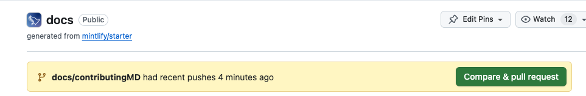

# Setting up Gitpod
Gitpod is relevant for all our repositories. If you’re looking for more guidance for the technologies used in each repo, please check out that repo’s documentation.

We use Gitpod to make sure everyone is working in the same preconfigured environment. Yes, you could of course download the repo and work on it on your machine but we strongly encourage using Gitpod instead. It’s straightforward to install and makes it easier to help each other out when we get stuck. 

<!--TODO: check with Taylor if this is correct -->
All our projects should automatically be on Distribute Aid’s 500 credits/50 hours sponsored plan. If you run into any issues with that, please reach out on Slack.

## Initial Gitpod setup
1. Sign up for an account (using Github)
    * Authorise
    * Continue with 10h a month
    * Select your preferred editor
    * Close tab again
2. Navigate to the repo you want to work on, go to the contributing.md file and click on the “open in Gitpod” button (leave the class set to “Standard”); you can also select other Distribute Aid repos in the dropdown
<!-- TODO: add screenshot -->
3. Hit enter and wait while your environment is being set up

## Using Gitpod with VSCode
1. If you opted to use the VSCode desktop app, Gitpod will now ask you to open the environment in VSCode. Accept this and follow the prompts to install the Gitpod extension and any missing plugins.
2. When prompted, authorise the Gitpod extension to sign in using Gitpod
3. Wait for VSCode to open the Distribute Aid folder and, when prompted, choose “trust the authors”
4. When you’re done working, make sure to go back to Gitpod Workspaces in your browser and click the three dots next to the workspace name to “stop the workspace”.

Note: Navigate to Gitpod Workspaces in your browser and pin the relevant workspace/repo by clicking the three dots next to the workspace name and selecting "Pin". This will allow you to access the workspace later and prevent it from being auto-deleted after 14 days.

## Adding a workspace
1. To add a new workspace, copy the repo URL from GitHub
2. Go to the Gitpod website
3. Click “new workspace” and paste the repo URL

### Setting up a new branch
<!-- TODO: is this the same everywhere? -->
If this is your first time pushing, you need to set up your branch and push it to GitHub first.

Create a new branch: ```git checkout -b <repo>/<branch name>```

Make your changes

Push to GitHub: ```git push --set-upstream origin docs/<branch name>```

The first time you’re doing this, you’ll have to go through authorisation (example from VSCode):


Do ```git push``` again

Then you should have the prompt for the PR in the repo on GitHub:



## Helpful commands

