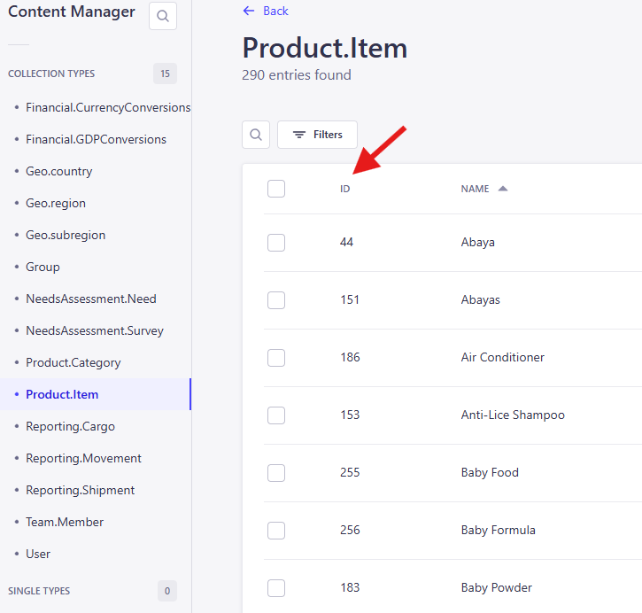

# Strapi ID number 

The Strapi ID number is a unique id assigned to each entry upon creation. It is usually the first field you will see of each entry line. Its value is different than the [document id](./ids.md) that is also assigned to each entry in Strapi. When accessing a relation field from a separate collection, this ID number is what will be required in order to populate the specific relation field type value in the desired collection (it must be included in the POST method for uploading data).

For example:
* the **category** for a specifc item in the _Product.Item_ collection will exist in the _Product.Category_ collection.
In order to populate the category field in the item collection, you must first get the ID number for that category from the _Product.Category_ collection.
Then use that ID number in the GET and POST method of the scripts in order to check if the item with that category already exists, and if not, create the new item that populates the category field using that ID number.

➡️ **Note**: It looks like using this ID number in API calls is going to be phased out and it is strongly encouraged to start using the [document id](./ids.md) in API calls with Strapi 5 and beyond. ([Strapi documentation](https://docs.strapi.io/cms/migration/v4-to-v5/breaking-changes/use-document-id))