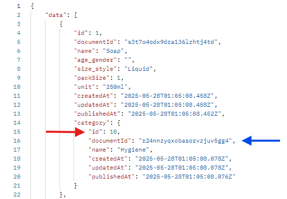

Created this file to add info relating to ids and if there needs to be a distinction between id and id number (or if document id comes into play here).

There is a distinct difference between the Strapi _ID number_ (seen as id) and the _document id_, as noted in the image below:  

Will need to discuss different id references to distinguish them from each other and what ids we use where

- In scripts, we currently use the Strapi ID number for each entry.
- In tests, we utilize both the Strapi ID number and the document id for an entry.

It is noted in the [Strapi documentation](https://docs.strapi.io/cms/migration/v4-to-v5/breaking-changes/use-document-id) that use of the _ID number_ will be phased out and it is now recommended to use the _document id_ instead in API calls.